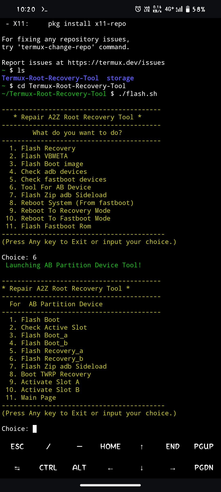

# Termux-Flash-Tool
This tool install Twrp Recovery, Boot.img, vbmeta.img Magisk Root in bootloader unlocked devices only

# installation :- 

```Install``` [termux](https://f-droid.org/repo/com.termux_118.apk) ```&``` [Termux-api](https://f-droid.org/repo/com.termux.api_51.apk) ```apk```
```console
yes | pkg update && upgrade
```
```console
termux-setup-storage
```
```console
pkg install termux-api
```
```console
yes | pkg install git
```

# Installation Termux-Root-Recovery-Tool :-

```console
https://github.com/nijwm089/Termux-Flash-Tool.git
```

```console
cd Termux-Flash-Tool
```
```console
chmod +x flash.sh && chmod +x flash-stock-rom.sh && chmod +x flashAB.sh
```
# installation Termux-Adb :-
[Termux-Adb Fastboot](https://github.com/nohajc/termux-adb) 

```credit :- Termux-Adb``` [nohajc](https://github.com/nohajc)

```console
bash installadb.sh
```

# Run Tool 

```console
./flash.sh
```

# For flashing Fastboot rom
1.Rename your fastboot rom folder to  ```miui-rom```

2.Copy ```miui-rom``` folder to  Download Folder Under internal storage 

 ```Now you can use Fastboot Rom Flash Option```
